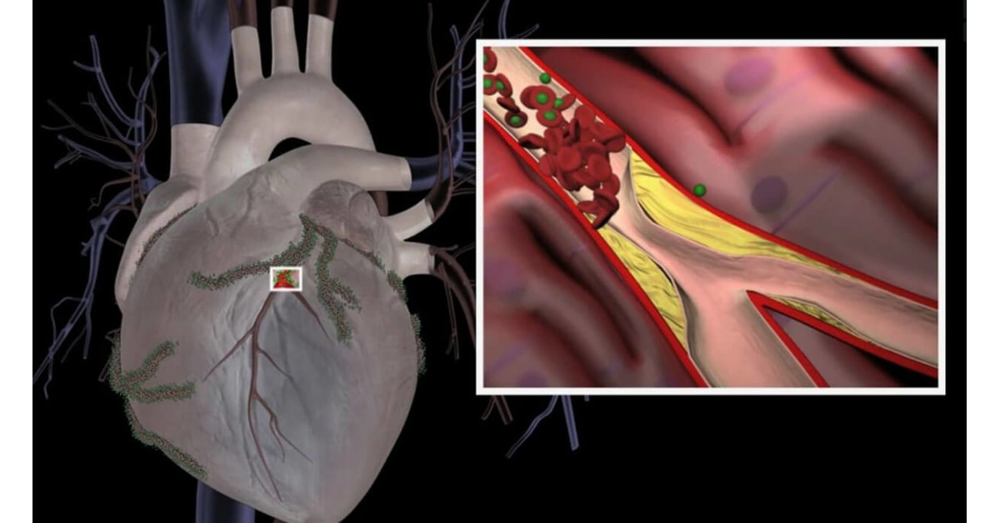
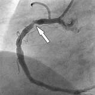

___
# Prediction of Heart Disease using ECG
___

#### Table of Contents
1. [Introduction](#introduction)
2. [Our Project](#overview)
3. [Team](#team)
4. [Links](#links)

## Introduction
A Myocardial Infarction or a Heart Attack occurs due to the lack of blood floor to heart muscles. This is an emergency medical condition where your heart muscles begin to die which could lead to permanent heart damage and even death. The main cause of a heart attack has been identified as Coronery Artery Disease i.e. blockages in the tubes of the circulation system.

The sure and the well-known way of knowing the risk of a MI is by performing an invasive angiogram. This method detects blokages using x-rays that are taken during injection of a contrast iodine dye. 
#### What are the issues associated with this procedure?
- It's an invasive procedure done under sedation with local anesthisia therefore has certain complications and side effects in the precedure although the high complications are very rare in most of the cases
[Read more about Angiograms](https://vascular.org/patient-resources/vascular-tests/angiogram)
- Not accessible everywhere at any time for just anybody
- Has to wait in waiting list
- Comparatively expenive
- There can be other causes of a heart attack which are not identified through angiograms

## Our Project
Our focus is to develop a solution to predict a potential myocardial infarction using a more accessible, less complicated and a more affordable method. Our approach is to develop an ECG based method to address this.
#### What is ECG?
An ECG (ElctroCardioGram) is used to analyze arrythmias i.e.irregularities in heart rhythms. There's an electrical system in the heart that conducts electric signal impulses that produces the pqrs waves on the ECG strip. These arrythmias occur when the electrical signals aren't working properly. Because injured heart muscles aren't able t0 conduct electrical impulses normally, ECGs usually identify a heart attack has occured or is in progress.
#### How can we incoporate ECG data in our solution?
A point to note in this particular domain is that there is no straight-forward way of detecting potential MIs directly from an ECG. Usually it is used to identify whether a heart attack has occured which produces abnormal heart rhythms on the ECG. We are developing an approach to identify potential MIs through minor arrythmias that are not very visible at early stages to the naked eye, through an automated computerized system.
#### Existing solutions
Various reaseaches have been done on this area. These projects have focused on automatic extraction of relavant and reliable information from ECG signals that has not been as easy task for a computerized system and classifying into heart disease classes.
[Read more about this research](https://www.researchgate.net/publication329318348_ECG_Signal_Classification_with_Deep_Learning_for_Heart_Disease_Identification)
Our approach is extending these reasearches to predict a risk of a MI.

## Team
### Developers
-  E/17/252, Kenath Perera, [email](mailto:e17252@eng.pdn.ac.lk)
-  E/17/242, Ruchika Perera, [email](mailto:e17242@eng.pdn.ac.lk)
-  E/17/044, Deanna Coralage, [email](mailto:e17044@eng.pdn.ac.lk)

### Scrum Master
-  Anjalee Wanigarathne, [email](mailto:anj.wanigarathne@eng.pdn.ac.lk)

### Product Owners
-  Dr. Dhammika Elkaduwa, [email](mailto:dhammika@eng.pdn.ac.lk)
-  Dr. Sampath Deegalla, [email](mailto:sampath@eng.pdn.ac.lk)

## Links
- [Department Projects](https://projects.ce.pdn.ac.lk)
- [Department of Computer Engineering](http://www.ce.pdn.ac.lk)
- [Faculty of Engineering](http://eng.pdn.ac.lk)
- [University of Peradeniya](https://www.pdn.ac.lk/academics/academics.php)
