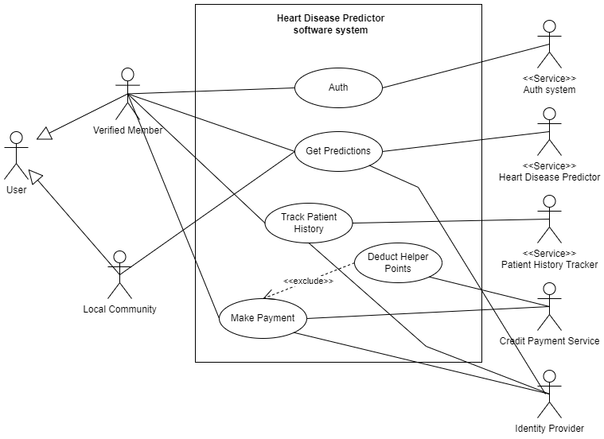
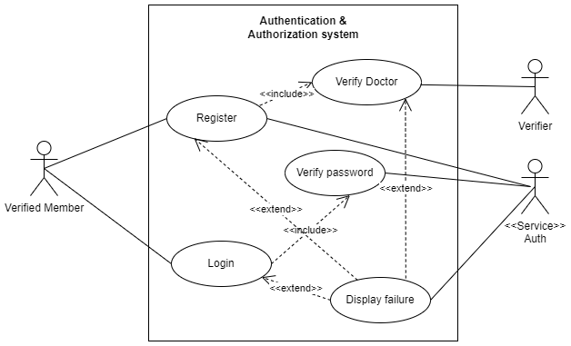
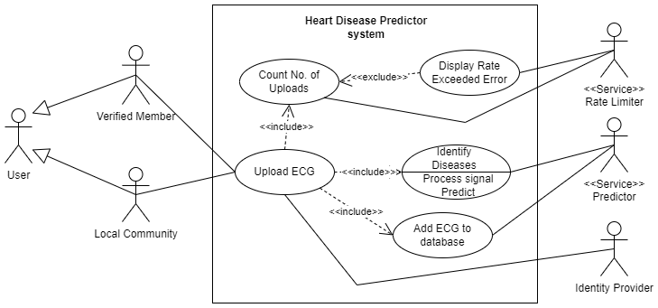

___
# Software Modelling
___

#### Table of Contents
1. [UML Class Diagram](#uml-class-diagram)
2. [Use Case Diagrams](#use-case-diagrams)

## UML Class Diagram

## Use Case Diagrams

### High-level Software System

### Authentication & Authorizatio System

### Heart Disease Predictor System

### Patient History Predictor System

